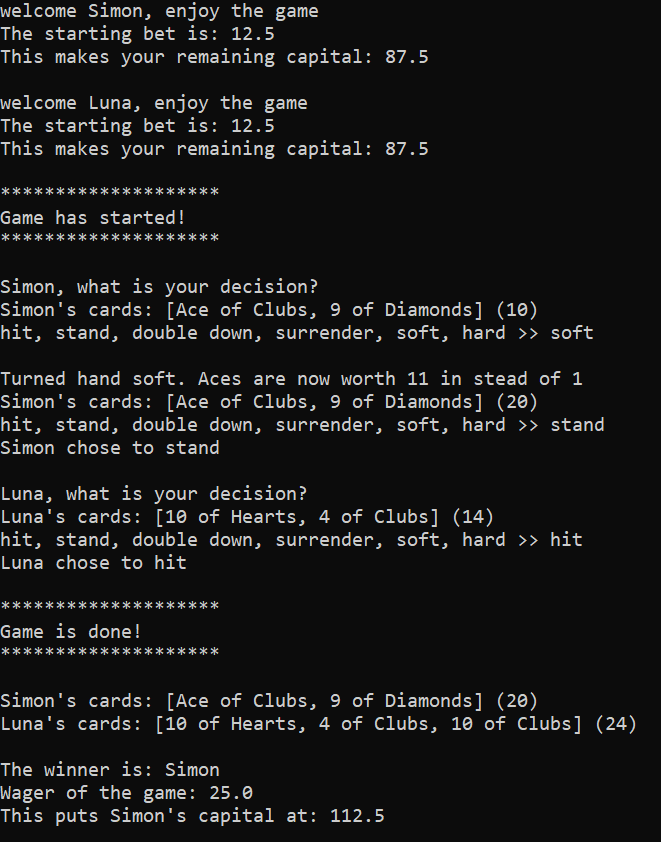
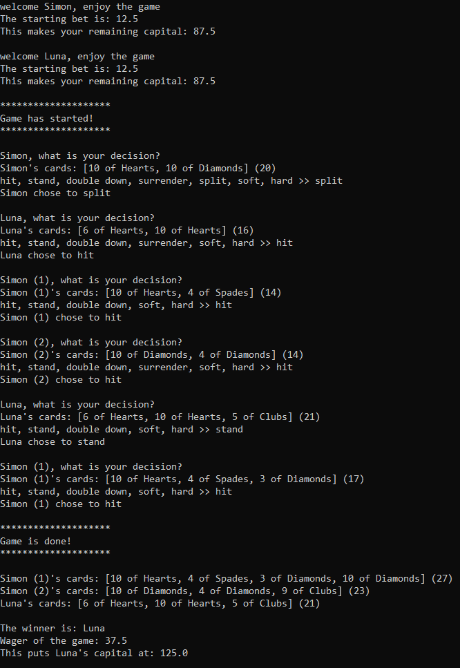

# Blackjack
While diving deeper in the realm of C#, I got the desire to test out some of these object-oriented principles in Python. During this specific project, I didn’t quite find opportunities for abstraction and interfaces. I did, however, focus to keep everything incapsulated.

These other, more complex topics, I would like to learn more about in C# and Java, since they seem more used and rooted in those environments.

The outcome was a fun game of Blackjack you could play in the console. As a general exercise I chose to include every mechanic of the game. Besides raising the bets, unless you double down.  

Below you can see some sample games. Note that the players have been hardcoded for demonstration purposes.

